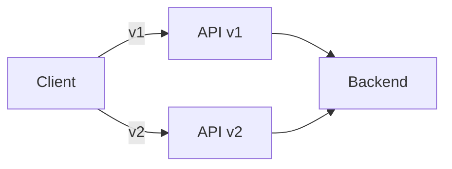
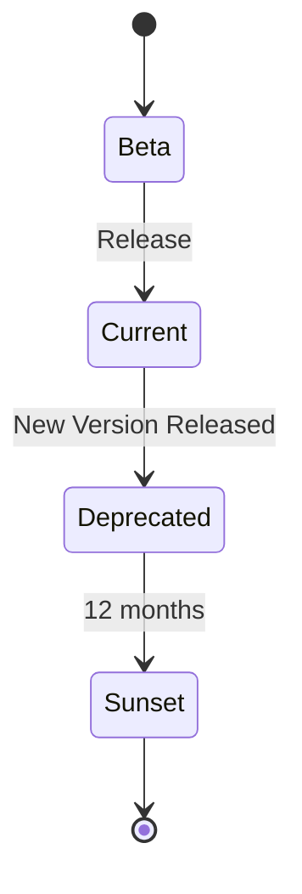

# API Versioning

The Festivals API uses URL-based versioning to ensure backward compatibility while allowing for API evolution. This document explains our versioning strategy and guidelines.

## Overview



## Version Format

API versions are included in the URL path:

```
https://api.festivals.app/v1/festivals
https://api.festivals.app/v2/festivals
```

## Current Versions

| Version | Status | Support Until |
|---------|--------|---------------|
| v1 | **Current** | Ongoing |
| v2 | Beta | TBD |

## Versioning Strategy

### What Triggers a New Major Version

- Removing or renaming fields
- Changing field types
- Changing response structure
- Removing endpoints
- Changing authentication methods
- Breaking changes to error formats

### What Does NOT Trigger a New Version

- Adding new endpoints
- Adding new optional fields to requests
- Adding new fields to responses
- Adding new query parameters
- Bug fixes
- Performance improvements
- New error codes (additive)

## Version Lifecycle



### Stages

| Stage | Description | Duration |
|-------|-------------|----------|
| **Beta** | Testing and feedback | 3-6 months |
| **Current** | Stable, recommended | Until superseded |
| **Deprecated** | Supported but not recommended | 12 months |
| **Sunset** | No longer available | - |

## Using API Versions

### URL-Based Versioning

Include the version in the URL path:

```bash
# Version 1
curl https://api.festivals.app/v1/festivals

# Version 2 (when available)
curl https://api.festivals.app/v2/festivals
```

### Default Version

If no version is specified, the API returns an error:

```bash
# This will return a 400 Bad Request
curl https://api.festivals.app/festivals
```

Response:
```json
{
  "error": {
    "code": "VERSION_REQUIRED",
    "message": "API version is required. Please use /v1/ or later in the URL path."
  }
}
```

## Deprecation Policy

### Deprecation Notices

When an API version is deprecated:

1. **Email Notification**: All API key holders receive email notification
2. **Response Headers**: Deprecation warnings in response headers
3. **Documentation Update**: Clear marking in documentation
4. **12-Month Support**: Minimum 12 months of continued support

### Deprecation Headers

Deprecated endpoints include these headers:

```http
HTTP/1.1 200 OK
Deprecation: true
Sunset: Sat, 1 Jan 2026 00:00:00 GMT
Link: <https://api.festivals.app/v2/festivals>; rel="successor-version"
X-Deprecation-Notice: This API version is deprecated. Please migrate to v2.
```

### Monitoring Deprecation

Check for deprecation headers in your application:

```javascript
async function apiRequest(url) {
  const response = await fetch(url);

  if (response.headers.get('Deprecation')) {
    console.warn('API Deprecation Notice:',
      response.headers.get('X-Deprecation-Notice'));
    console.warn('Sunset Date:',
      response.headers.get('Sunset'));
    console.warn('New Version:',
      response.headers.get('Link'));
  }

  return response.json();
}
```

## Migration Guide

### Checking Your Version

Identify which API version you're using:

```bash
# Check current version in use
curl -I https://api.festivals.app/v1/festivals
```

Look for the `X-API-Version` response header:

```http
X-API-Version: 1.0.0
```

### Migration Steps

1. **Review Changelog**: Check the migration guide for breaking changes
2. **Update Endpoints**: Change URL paths to new version
3. **Update Request Payloads**: Adjust request bodies if needed
4. **Update Response Handling**: Handle new response formats
5. **Test Thoroughly**: Use staging environment for testing
6. **Monitor for Issues**: Watch for errors after migration

### Example: v1 to v2 Migration

```javascript
// Before (v1)
const response = await fetch('https://api.festivals.app/v1/festivals');
const data = await response.json();
const festivals = data.data; // Array of festivals

// After (v2) - hypothetical changes
const response = await fetch('https://api.festivals.app/v2/festivals');
const data = await response.json();
const festivals = data.items; // Renamed field
const pagination = data.pagination; // New pagination format
```

## Version-Specific Features

### v1 Features

- Offset-based pagination
- JWT and API Key authentication
- Standard error format
- Webhook support

### v2 Features (Beta)

- Cursor-based pagination (optional)
- Enhanced filtering syntax
- GraphQL endpoint (experimental)
- Improved real-time capabilities

## API Changelog

### v1.0.0 (Current)

Initial stable release:
- Festival management endpoints
- Wallet and payment operations
- Ticket scanning and validation
- NFC tag management
- Offline transaction sync
- Webhook notifications

### v1.1.0

Minor additions:
- Added `lineup` endpoints
- Added `map` endpoints
- New filter operators
- Enhanced error details

### v1.2.0

Minor additions:
- Added `chatbot` endpoints
- Added `inventory` management
- Bulk operation endpoints
- Enhanced analytics

## Best Practices

### 1. Always Specify Version

```bash
# Good
GET /v1/festivals

# Bad - no version
GET /festivals
```

### 2. Subscribe to Updates

Sign up for API updates at [developers.festivals.app](https://developers.festivals.app) to receive:
- Deprecation notices
- New version announcements
- Breaking change alerts

### 3. Test Against Staging

Before updating your production integration:

```bash
# Test new version in staging
curl https://staging-api.festivals.app/v2/festivals
```

### 4. Handle Version Headers

```javascript
const API_VERSION = 'v1';

async function apiRequest(endpoint) {
  const response = await fetch(`https://api.festivals.app/${API_VERSION}${endpoint}`);

  // Log version info for debugging
  console.log('API Version:', response.headers.get('X-API-Version'));

  return response.json();
}
```

### 5. Plan for Deprecation

- Don't hardcode version numbers deep in code
- Use configuration or constants
- Monitor deprecation headers
- Set calendar reminders for sunset dates

## SDK Version Support

Our SDKs support multiple API versions:

### JavaScript SDK

```javascript
import { FestivalsClient } from '@festivals/sdk';

// Specify version
const client = new FestivalsClient({
  apiVersion: 'v1', // or 'v2'
  apiKey: 'your-api-key'
});
```

### Mobile SDKs

See [Mobile Integration Guide](../sdk/MOBILE.md) for version configuration.

## Getting Help

- **Migration assistance**: Contact support@festivals.io
- **Version questions**: developers@festivals.io
- **API status**: [status.festivals.app](https://status.festivals.app)
- **Changelog**: [changelog.festivals.app](https://changelog.festivals.app)
