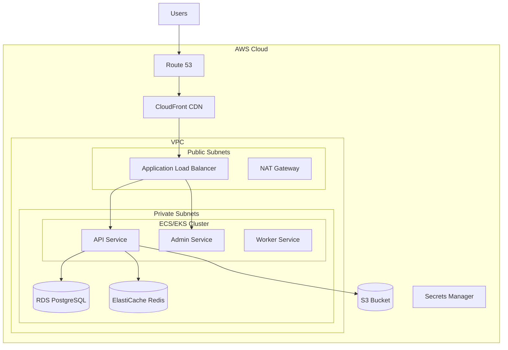

# AWS Deployment Guide

This guide covers deploying the Festivals platform on Amazon Web Services (AWS) using ECS, EKS, or EC2.

## Overview



## Deployment Options

| Option | Best For | Complexity |
|--------|----------|------------|
| **ECS Fargate** | Serverless containers | Low |
| **ECS EC2** | Cost optimization | Medium |
| **EKS** | Kubernetes ecosystem | High |
| **EC2 + Docker** | Full control | High |

## ECS Fargate Deployment

### Prerequisites

- AWS CLI configured
- ECR repository created
- VPC with public/private subnets

### Infrastructure Setup

#### VPC Configuration

```bash
# Create VPC using CloudFormation
aws cloudformation create-stack \
  --stack-name festivals-vpc \
  --template-body file://cloudformation/vpc.yaml \
  --parameters ParameterKey=Environment,ParameterValue=production
```

#### ECR Repository

```bash
# Create ECR repository
aws ecr create-repository \
  --repository-name festivals/api \
  --image-scanning-configuration scanOnPush=true

aws ecr create-repository \
  --repository-name festivals/admin \
  --image-scanning-configuration scanOnPush=true
```

#### Push Images

```bash
# Login to ECR
aws ecr get-login-password --region eu-west-1 | \
  docker login --username AWS --password-stdin 123456789.dkr.ecr.eu-west-1.amazonaws.com

# Build and push
docker build -t festivals/api ./backend
docker tag festivals/api:latest 123456789.dkr.ecr.eu-west-1.amazonaws.com/festivals/api:latest
docker push 123456789.dkr.ecr.eu-west-1.amazonaws.com/festivals/api:latest
```

### ECS Task Definition

```json
{
  "family": "festivals-api",
  "networkMode": "awsvpc",
  "requiresCompatibilities": ["FARGATE"],
  "cpu": "512",
  "memory": "1024",
  "executionRoleArn": "arn:aws:iam::123456789:role/ecsTaskExecutionRole",
  "taskRoleArn": "arn:aws:iam::123456789:role/festivalsTaskRole",
  "containerDefinitions": [
    {
      "name": "api",
      "image": "123456789.dkr.ecr.eu-west-1.amazonaws.com/festivals/api:latest",
      "portMappings": [
        {
          "containerPort": 8080,
          "protocol": "tcp"
        }
      ],
      "environment": [
        {"name": "PORT", "value": "8080"},
        {"name": "ENVIRONMENT", "value": "production"},
        {"name": "LOG_FORMAT", "value": "json"}
      ],
      "secrets": [
        {
          "name": "DATABASE_URL",
          "valueFrom": "arn:aws:secretsmanager:eu-west-1:123456789:secret:festivals/database:url::"
        },
        {
          "name": "AUTH0_CLIENT_SECRET",
          "valueFrom": "arn:aws:secretsmanager:eu-west-1:123456789:secret:festivals/auth0:client_secret::"
        }
      ],
      "logConfiguration": {
        "logDriver": "awslogs",
        "options": {
          "awslogs-group": "/ecs/festivals-api",
          "awslogs-region": "eu-west-1",
          "awslogs-stream-prefix": "api"
        }
      },
      "healthCheck": {
        "command": ["CMD-SHELL", "wget -q --spider http://localhost:8080/health || exit 1"],
        "interval": 30,
        "timeout": 5,
        "retries": 3,
        "startPeriod": 60
      }
    }
  ]
}
```

### ECS Service

```bash
# Create ECS service
aws ecs create-service \
  --cluster festivals-cluster \
  --service-name festivals-api \
  --task-definition festivals-api:1 \
  --desired-count 2 \
  --launch-type FARGATE \
  --network-configuration "awsvpcConfiguration={subnets=[subnet-xxx,subnet-yyy],securityGroups=[sg-xxx],assignPublicIp=DISABLED}" \
  --load-balancers "targetGroupArn=arn:aws:elasticloadbalancing:eu-west-1:123456789:targetgroup/festivals-api/xxx,containerName=api,containerPort=8080"
```

### Application Load Balancer

```bash
# Create ALB
aws elbv2 create-load-balancer \
  --name festivals-alb \
  --subnets subnet-public-1 subnet-public-2 \
  --security-groups sg-alb \
  --scheme internet-facing \
  --type application

# Create target group
aws elbv2 create-target-group \
  --name festivals-api \
  --protocol HTTP \
  --port 8080 \
  --vpc-id vpc-xxx \
  --target-type ip \
  --health-check-path /health

# Create listener
aws elbv2 create-listener \
  --load-balancer-arn arn:aws:elasticloadbalancing:eu-west-1:123456789:loadbalancer/app/festivals-alb/xxx \
  --protocol HTTPS \
  --port 443 \
  --certificates CertificateArn=arn:aws:acm:eu-west-1:123456789:certificate/xxx \
  --default-actions Type=forward,TargetGroupArn=arn:aws:elasticloadbalancing:eu-west-1:123456789:targetgroup/festivals-api/xxx
```

## RDS PostgreSQL

### Create RDS Instance

```bash
aws rds create-db-instance \
  --db-instance-identifier festivals-db \
  --db-instance-class db.t3.medium \
  --engine postgres \
  --engine-version 16.1 \
  --master-username admin \
  --master-user-password $(aws secretsmanager get-random-password --query RandomPassword --output text) \
  --allocated-storage 100 \
  --storage-type gp3 \
  --vpc-security-group-ids sg-database \
  --db-subnet-group-name festivals-db-subnet \
  --backup-retention-period 7 \
  --multi-az \
  --storage-encrypted \
  --deletion-protection
```

### RDS Configuration

```yaml
# Recommended settings
Engine: PostgreSQL 16
Instance: db.t3.medium (dev), db.r6g.large (prod)
Storage: 100GB gp3
Multi-AZ: Yes (production)
Backups: 7 days retention
Encryption: Yes (AWS managed key)
Performance Insights: Enabled
```

## ElastiCache Redis

```bash
aws elasticache create-replication-group \
  --replication-group-id festivals-redis \
  --replication-group-description "Festivals Redis cluster" \
  --engine redis \
  --cache-node-type cache.t3.medium \
  --num-cache-clusters 2 \
  --automatic-failover-enabled \
  --cache-subnet-group-name festivals-cache-subnet \
  --security-group-ids sg-cache \
  --at-rest-encryption-enabled \
  --transit-encryption-enabled \
  --auth-token $(aws secretsmanager get-random-password --query RandomPassword --output text)
```

## S3 Storage

### Create Bucket

```bash
aws s3api create-bucket \
  --bucket festivals-media-production \
  --region eu-west-1 \
  --create-bucket-configuration LocationConstraint=eu-west-1

# Enable versioning
aws s3api put-bucket-versioning \
  --bucket festivals-media-production \
  --versioning-configuration Status=Enabled

# Enable encryption
aws s3api put-bucket-encryption \
  --bucket festivals-media-production \
  --server-side-encryption-configuration '{"Rules":[{"ApplyServerSideEncryptionByDefault":{"SSEAlgorithm":"AES256"}}]}'
```

### Bucket Policy

```json
{
  "Version": "2012-10-17",
  "Statement": [
    {
      "Effect": "Allow",
      "Principal": {
        "AWS": "arn:aws:iam::123456789:role/festivalsTaskRole"
      },
      "Action": [
        "s3:GetObject",
        "s3:PutObject",
        "s3:DeleteObject"
      ],
      "Resource": "arn:aws:s3:::festivals-media-production/*"
    }
  ]
}
```

## CloudFront CDN

```bash
aws cloudfront create-distribution \
  --origin-domain-name festivals-media-production.s3.eu-west-1.amazonaws.com \
  --default-root-object index.html
```

### CloudFront Configuration

```yaml
Origins:
  - S3 bucket for static assets
  - ALB for API (with custom headers)

Behaviors:
  - /api/*: Forward to ALB
  - /static/*: S3 with caching
  - Default: S3

Cache Policy:
  - API: No caching (origin only)
  - Static: 1 year max-age

SSL: ACM certificate
HTTP/2: Enabled
IPv6: Enabled
```

## Secrets Manager

### Store Secrets

```bash
# Database credentials
aws secretsmanager create-secret \
  --name festivals/production/database \
  --secret-string '{"host":"festivals-db.xxx.eu-west-1.rds.amazonaws.com","port":5432,"username":"admin","password":"xxx"}'

# Auth0 credentials
aws secretsmanager create-secret \
  --name festivals/production/auth0 \
  --secret-string '{"domain":"xxx.auth0.com","client_id":"xxx","client_secret":"xxx"}'

# Stripe keys
aws secretsmanager create-secret \
  --name festivals/production/stripe \
  --secret-string '{"secret_key":"sk_live_xxx","webhook_secret":"whsec_xxx"}'
```

## Auto Scaling

### ECS Service Auto Scaling

```bash
# Register scalable target
aws application-autoscaling register-scalable-target \
  --service-namespace ecs \
  --resource-id service/festivals-cluster/festivals-api \
  --scalable-dimension ecs:service:DesiredCount \
  --min-capacity 2 \
  --max-capacity 20

# Create scaling policy (CPU)
aws application-autoscaling put-scaling-policy \
  --service-namespace ecs \
  --resource-id service/festivals-cluster/festivals-api \
  --scalable-dimension ecs:service:DesiredCount \
  --policy-name festivals-api-cpu-scaling \
  --policy-type TargetTrackingScaling \
  --target-tracking-scaling-policy-configuration '{
    "TargetValue": 70.0,
    "PredefinedMetricSpecification": {
      "PredefinedMetricType": "ECSServiceAverageCPUUtilization"
    },
    "ScaleInCooldown": 300,
    "ScaleOutCooldown": 60
  }'
```

## CloudWatch Monitoring

### Create Dashboard

```bash
aws cloudwatch put-dashboard \
  --dashboard-name festivals-production \
  --dashboard-body file://cloudwatch-dashboard.json
```

### Alarms

```bash
# High CPU alarm
aws cloudwatch put-metric-alarm \
  --alarm-name festivals-api-high-cpu \
  --alarm-description "API CPU utilization is high" \
  --metric-name CPUUtilization \
  --namespace AWS/ECS \
  --statistic Average \
  --period 300 \
  --threshold 80 \
  --comparison-operator GreaterThanThreshold \
  --dimensions Name=ClusterName,Value=festivals-cluster Name=ServiceName,Value=festivals-api \
  --evaluation-periods 3 \
  --alarm-actions arn:aws:sns:eu-west-1:123456789:festivals-alerts

# API error rate alarm
aws cloudwatch put-metric-alarm \
  --alarm-name festivals-api-error-rate \
  --alarm-description "API error rate is high" \
  --metric-name HTTPCode_Target_5XX_Count \
  --namespace AWS/ApplicationELB \
  --statistic Sum \
  --period 60 \
  --threshold 10 \
  --comparison-operator GreaterThanThreshold \
  --dimensions Name=LoadBalancer,Value=app/festivals-alb/xxx Name=TargetGroup,Value=targetgroup/festivals-api/xxx \
  --evaluation-periods 5 \
  --alarm-actions arn:aws:sns:eu-west-1:123456789:festivals-alerts
```

## Cost Optimization

### Reserved Instances

- RDS Reserved Instances for database
- Savings Plans for Fargate

### Spot Instances

For non-critical workloads:

```json
{
  "capacityProviderStrategy": [
    {
      "capacityProvider": "FARGATE",
      "weight": 1,
      "base": 2
    },
    {
      "capacityProvider": "FARGATE_SPOT",
      "weight": 4
    }
  ]
}
```

### Right-sizing

Regularly review:
- Container CPU/memory allocation
- RDS instance size
- ElastiCache node type

## Security

### IAM Roles

```json
{
  "Version": "2012-10-17",
  "Statement": [
    {
      "Effect": "Allow",
      "Action": [
        "secretsmanager:GetSecretValue"
      ],
      "Resource": [
        "arn:aws:secretsmanager:eu-west-1:123456789:secret:festivals/*"
      ]
    },
    {
      "Effect": "Allow",
      "Action": [
        "s3:GetObject",
        "s3:PutObject"
      ],
      "Resource": [
        "arn:aws:s3:::festivals-media-production/*"
      ]
    }
  ]
}
```

### Security Groups

```
API Service:
  - Inbound: 8080 from ALB security group
  - Outbound: 5432 to RDS, 6379 to Redis, 443 to internet

Database:
  - Inbound: 5432 from API security group
  - Outbound: None

Cache:
  - Inbound: 6379 from API security group
  - Outbound: None
```

## Terraform Example

```hcl
# ECS Cluster
resource "aws_ecs_cluster" "festivals" {
  name = "festivals-cluster"

  setting {
    name  = "containerInsights"
    value = "enabled"
  }
}

# ECS Service
resource "aws_ecs_service" "api" {
  name            = "festivals-api"
  cluster         = aws_ecs_cluster.festivals.id
  task_definition = aws_ecs_task_definition.api.arn
  desired_count   = 2
  launch_type     = "FARGATE"

  network_configuration {
    subnets          = var.private_subnets
    security_groups  = [aws_security_group.api.id]
    assign_public_ip = false
  }

  load_balancer {
    target_group_arn = aws_lb_target_group.api.arn
    container_name   = "api"
    container_port   = 8080
  }
}
```

## Related Documentation

- [Docker Deployment](./DOCKER.md)
- [Kubernetes Deployment](./KUBERNETES.md)
- [Environment Variables](./ENVIRONMENT.md)
- [Scaling Strategies](./SCALING.md)
