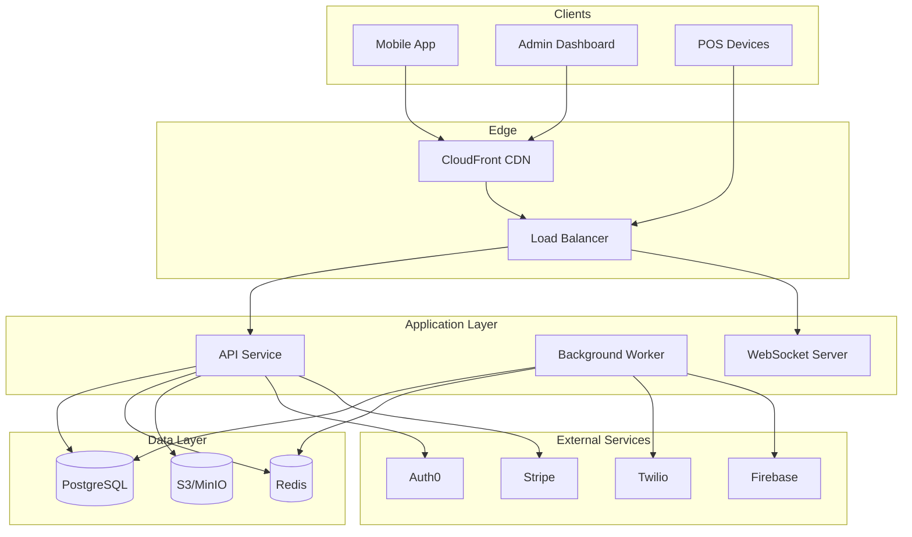
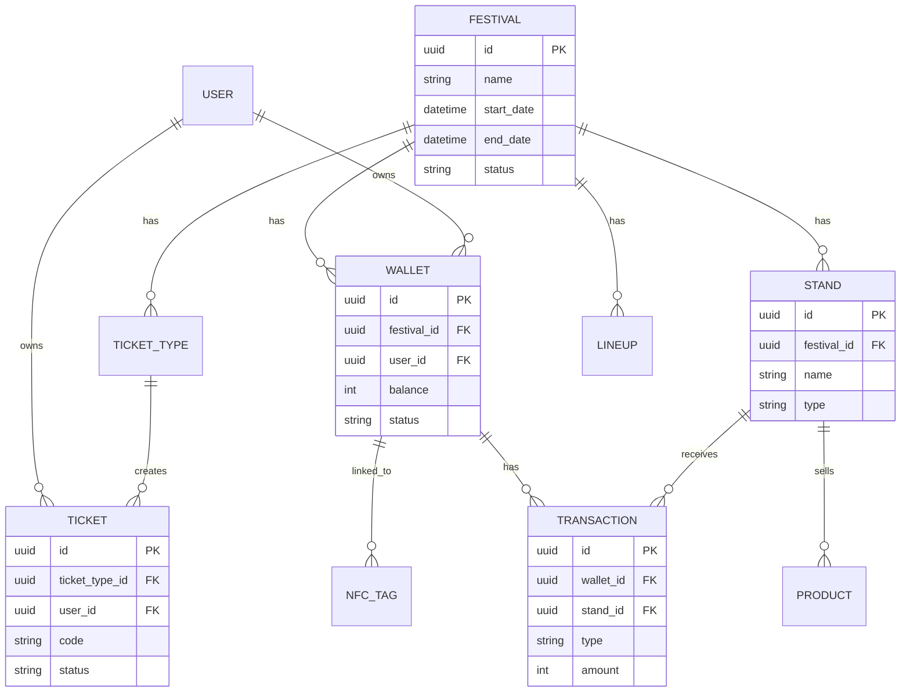
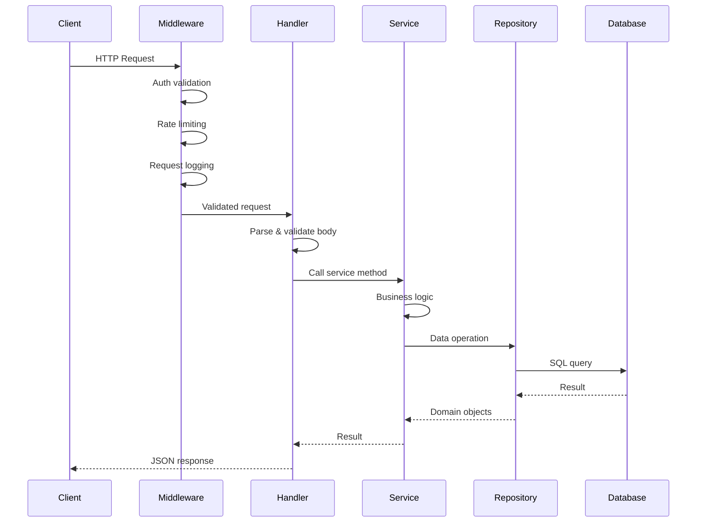
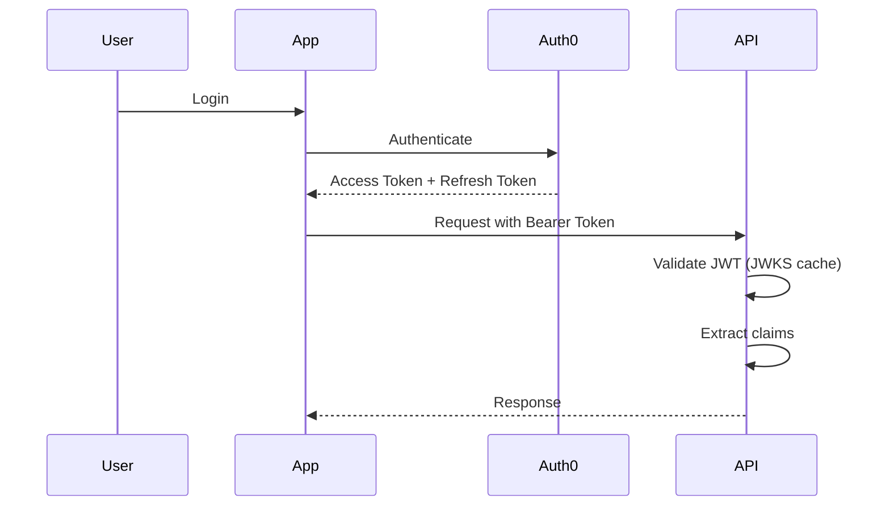
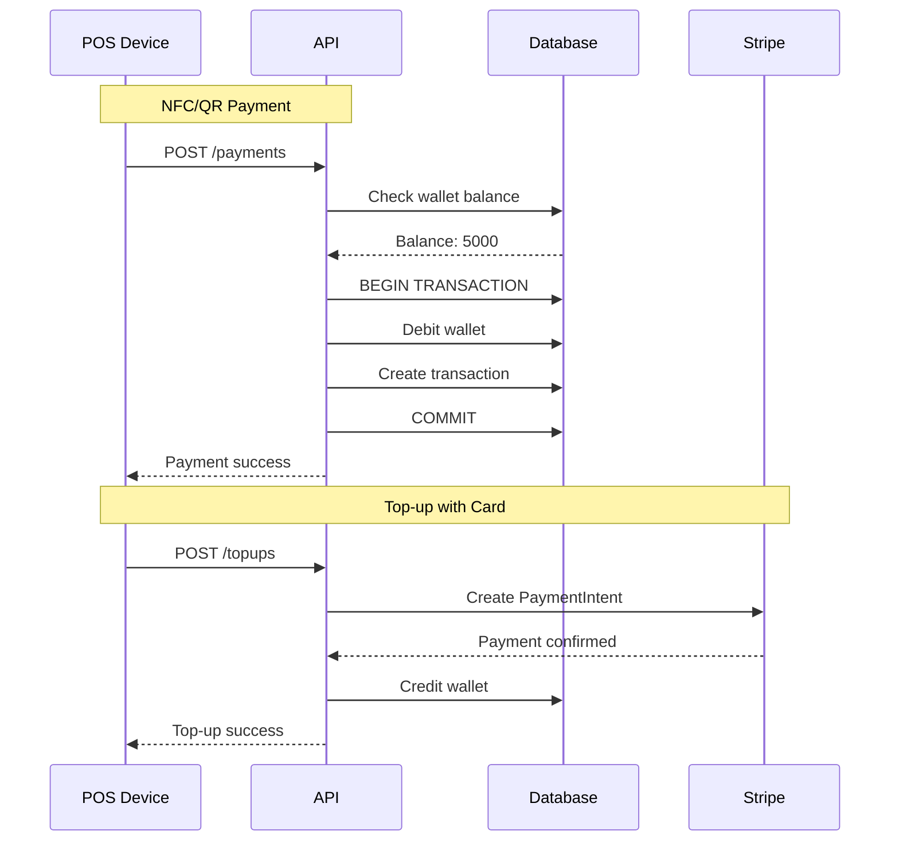
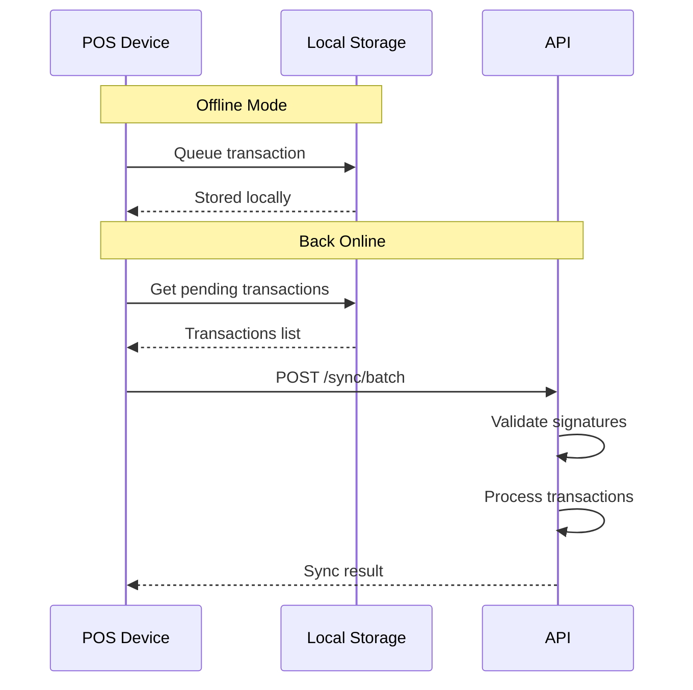
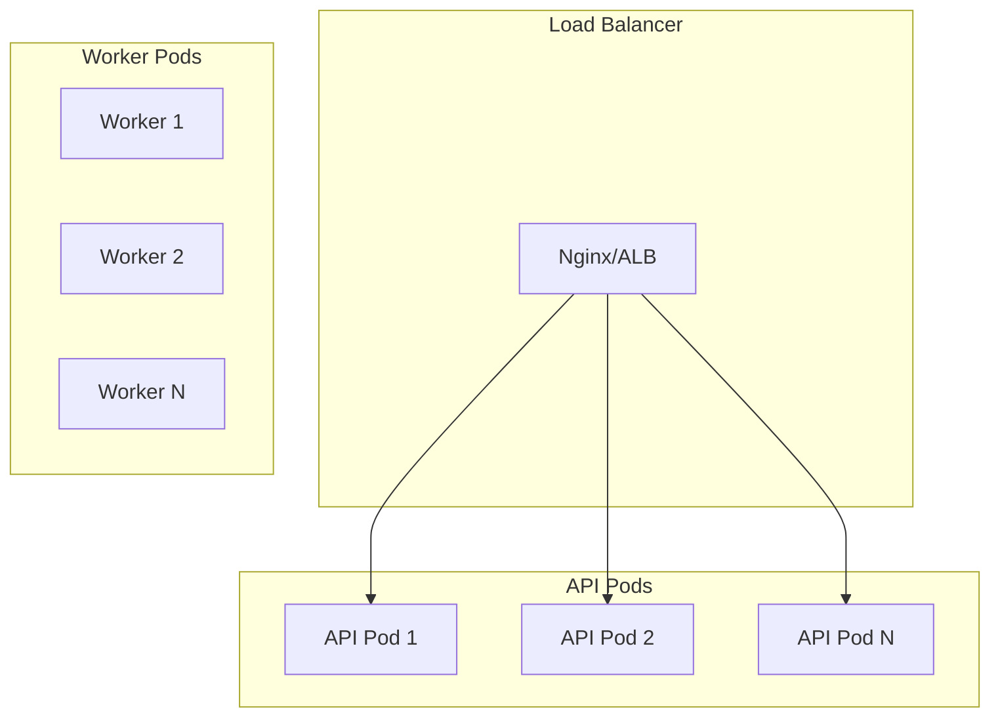
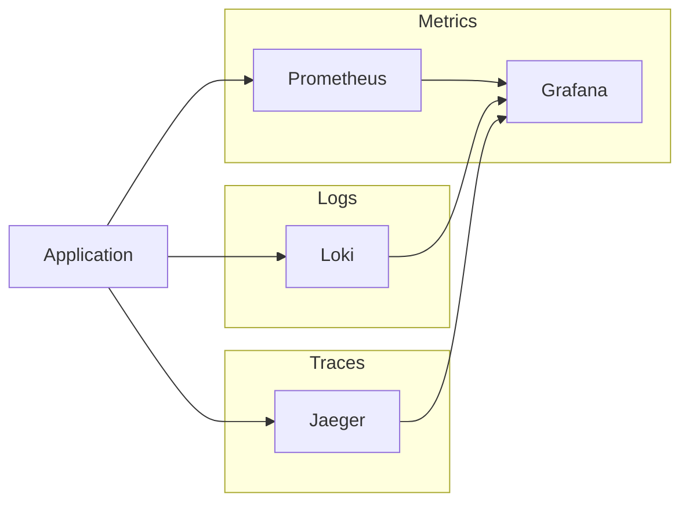

# System Architecture

This document provides an overview of the Festivals platform architecture.

## High-Level Overview



## Components

### Mobile Application

- **Technology:** React Native + Expo
- **Features:**
  - Attendee wallet and payments
  - Ticket management
  - Festival information
  - Offline support

### Admin Dashboard

- **Technology:** Next.js 14 + TypeScript
- **Features:**
  - Festival management
  - Analytics and reporting
  - User management
  - Real-time monitoring

### Backend API

- **Technology:** Go + Gin
- **Features:**
  - RESTful API
  - JWT authentication
  - Rate limiting
  - Request validation

### Background Worker

- **Technology:** Go + Asynq
- **Features:**
  - Email/SMS notifications
  - Report generation
  - Data synchronization
  - Scheduled tasks

## Domain Model



## Backend Architecture

### Layer Structure

```
┌─────────────────────────────────────────┐
│              HTTP Handler                │
│  (Request parsing, response formatting)  │
├─────────────────────────────────────────┤
│              Middleware                  │
│  (Auth, logging, rate limiting, etc.)   │
├─────────────────────────────────────────┤
│               Service                    │
│     (Business logic, validation)         │
├─────────────────────────────────────────┤
│              Repository                  │
│         (Data access layer)              │
├─────────────────────────────────────────┤
│             Infrastructure               │
│   (Database, cache, external services)   │
└─────────────────────────────────────────┘
```

### Domain-Driven Design

Each domain follows a consistent structure:

```
internal/domain/wallet/
├── model.go        # Domain entities and value objects
├── repository.go   # Repository interface
├── service.go      # Business logic
├── handler.go      # HTTP handlers
└── service_test.go # Unit tests
```

### Request Flow



## Data Architecture

### PostgreSQL

Primary data store for all persistent data.

**Key tables:**
- `festivals` - Festival information
- `wallets` - User wallets with balances
- `transactions` - Payment history
- `tickets` - Ticket inventory
- `stands` - Vendor information
- `products` - Product catalog

**Optimizations:**
- Partitioned tables for transactions (by date)
- Indexes on frequently queried columns
- Connection pooling with PgBouncer

### Redis

Used for caching and real-time features.

**Use cases:**
- Session storage
- API response caching
- Rate limiting counters
- Real-time pub/sub
- Job queue (Asynq)

### S3/MinIO

Object storage for media files.

**Stored content:**
- Festival images
- Product photos
- QR code images
- Export files

## Authentication Flow



### Token Claims

Custom claims added via Auth0 Actions:

```json
{
  "sub": "auth0|123456",
  "https://festivals.app/roles": ["ORGANIZER"],
  "https://festivals.app/festival_id": "fest-123",
  "https://festivals.app/stand_ids": ["stand-456"]
}
```

## Payment Flow



## Offline Support

The platform supports offline operations for areas with poor connectivity.



### Offline Security

- Transactions signed with device key
- Balance limits enforced locally
- Timestamp validation on sync
- Conflict resolution for double-spends

## Scalability

### Horizontal Scaling



### Scaling Triggers

| Metric | Scale Up | Scale Down |
|--------|----------|------------|
| CPU | > 70% | < 30% |
| Memory | > 80% | < 40% |
| Queue Length | > 100 | < 10 |
| Request Rate | > 1000 rps | < 200 rps |

## Security Architecture

### Defense in Depth

```
┌─────────────────────────────────────────┐
│         WAF (Web Application Firewall)   │
├─────────────────────────────────────────┤
│         Rate Limiting (per IP/User)      │
├─────────────────────────────────────────┤
│         Authentication (JWT/API Key)     │
├─────────────────────────────────────────┤
│         Authorization (RBAC)             │
├─────────────────────────────────────────┤
│         Input Validation                 │
├─────────────────────────────────────────┤
│         Encrypted Data (TLS, at-rest)    │
└─────────────────────────────────────────┘
```

### Data Protection

- TLS 1.3 for all communications
- AES-256 encryption at rest
- PII handled according to GDPR
- PCI-DSS compliant payment handling

## Observability

### Three Pillars



### Key Metrics

- Request rate and latency (RED method)
- Error rates by endpoint
- Database connection pool
- Cache hit rates
- Business metrics (transactions, scans)

## Technology Stack Summary

| Layer | Technology |
|-------|------------|
| Mobile | React Native, Expo, TypeScript |
| Admin | Next.js 14, TypeScript, Tailwind CSS |
| API | Go 1.23, Gin, GORM |
| Worker | Go, Asynq |
| Database | PostgreSQL 16 |
| Cache | Redis 7 |
| Storage | S3/MinIO |
| Auth | Auth0 |
| Payments | Stripe |
| Container | Docker, Kubernetes |
| CI/CD | GitHub Actions |
| Monitoring | Prometheus, Grafana, Loki |

## Related Documentation

- [Local Setup](./SETUP.md)
- [API Documentation](../api/)
- [Deployment](../deployment/)
