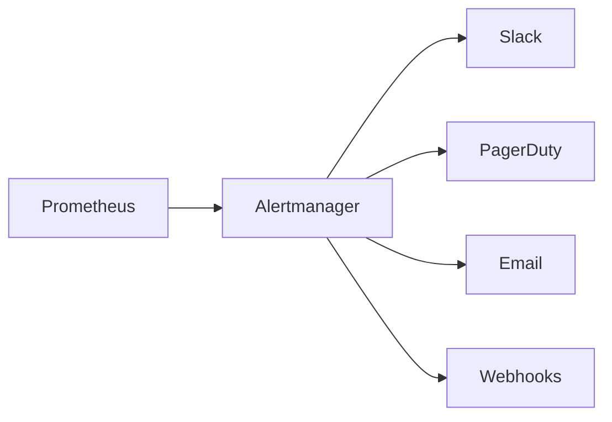

# Alerting Configuration

This guide covers alert rules, escalation policies, and incident response for the Festivals platform.

## Overview



## Alert Severity Levels

| Severity | Response Time | Examples |
|----------|---------------|----------|
| **Critical** | 15 minutes | Service down, data loss risk, payment failures |
| **Warning** | 1 hour | Degraded performance, high error rates |
| **Info** | Next business day | Capacity planning, trends |

## Alert Rules

### Availability Alerts

```yaml
groups:
  - name: availability
    rules:
      # Service Down
      - alert: APIServiceDown
        expr: up{job="festivals-api"} == 0
        for: 2m
        labels:
          severity: critical
          service: api
        annotations:
          summary: "API service is down"
          description: "API service has been down for more than 2 minutes"
          runbook_url: "https://docs.festivals.app/runbook#api-down"

      # High Error Rate
      - alert: HighErrorRate
        expr: |
          sum(rate(festivals_http_requests_total{status=~"5.."}[5m])) /
          sum(rate(festivals_http_requests_total[5m])) > 0.01
        for: 5m
        labels:
          severity: critical
          service: api
        annotations:
          summary: "High error rate detected"
          description: "Error rate is {{ $value | humanizePercentage }} (threshold: 1%)"
          runbook_url: "https://docs.festivals.app/runbook#high-error-rate"

      # Service Availability SLO
      - alert: AvailabilitySLOBreach
        expr: |
          1 - (
            sum(rate(festivals_http_requests_total{status=~"5.."}[1h])) /
            sum(rate(festivals_http_requests_total[1h]))
          ) < 0.999
        for: 10m
        labels:
          severity: warning
          service: api
        annotations:
          summary: "Availability SLO at risk"
          description: "Current availability is {{ $value | humanizePercentage }}, below 99.9% SLO"
```

### Latency Alerts

```yaml
groups:
  - name: latency
    rules:
      # High Latency (p99)
      - alert: HighLatencyP99
        expr: |
          histogram_quantile(0.99,
            sum(rate(festivals_http_request_duration_seconds_bucket[5m])) by (le)
          ) > 0.5
        for: 5m
        labels:
          severity: warning
          service: api
        annotations:
          summary: "High p99 latency"
          description: "p99 latency is {{ $value | humanizeDuration }}"
          runbook_url: "https://docs.festivals.app/runbook#high-latency"

      # Latency SLO
      - alert: LatencySLOBreach
        expr: |
          histogram_quantile(0.95,
            sum(rate(festivals_http_request_duration_seconds_bucket[1h])) by (le)
          ) > 0.2
        for: 10m
        labels:
          severity: warning
          service: api
        annotations:
          summary: "Latency SLO at risk"
          description: "p95 latency is {{ $value | humanizeDuration }}, above 200ms SLO"
```

### Resource Alerts

```yaml
groups:
  - name: resources
    rules:
      # High CPU
      - alert: HighCPUUsage
        expr: |
          avg(rate(container_cpu_usage_seconds_total{container="api"}[5m])) /
          avg(kube_pod_container_resource_limits{container="api", resource="cpu"}) > 0.8
        for: 10m
        labels:
          severity: warning
          service: api
        annotations:
          summary: "High CPU usage"
          description: "CPU usage is {{ $value | humanizePercentage }}"

      # High Memory
      - alert: HighMemoryUsage
        expr: |
          avg(container_memory_usage_bytes{container="api"}) /
          avg(kube_pod_container_resource_limits{container="api", resource="memory"}) > 0.85
        for: 10m
        labels:
          severity: warning
          service: api
        annotations:
          summary: "High memory usage"
          description: "Memory usage is {{ $value | humanizePercentage }}"

      # Pod Restarts
      - alert: PodRestartingFrequently
        expr: increase(kube_pod_container_status_restarts_total{namespace="festivals"}[1h]) > 5
        for: 5m
        labels:
          severity: warning
        annotations:
          summary: "Pod restarting frequently"
          description: "Pod {{ $labels.pod }} has restarted {{ $value }} times in the last hour"
```

### Database Alerts

```yaml
groups:
  - name: database
    rules:
      # Connection Pool Exhaustion
      - alert: DatabaseConnectionPoolExhausted
        expr: festivals_db_connections_open > 20
        for: 5m
        labels:
          severity: warning
          service: database
        annotations:
          summary: "Database connection pool nearly exhausted"
          description: "{{ $value }} connections open out of 25 max"

      # Slow Queries
      - alert: SlowDatabaseQueries
        expr: |
          histogram_quantile(0.99,
            sum(rate(festivals_db_query_duration_seconds_bucket[5m])) by (le)
          ) > 0.1
        for: 5m
        labels:
          severity: warning
          service: database
        annotations:
          summary: "Slow database queries detected"
          description: "p99 query time is {{ $value | humanizeDuration }}"

      # Database Down
      - alert: DatabaseDown
        expr: pg_up == 0
        for: 1m
        labels:
          severity: critical
          service: database
        annotations:
          summary: "PostgreSQL is down"
          runbook_url: "https://docs.festivals.app/runbook#database-down"
```

### Business Alerts

```yaml
groups:
  - name: business
    rules:
      # Payment Failures
      - alert: HighPaymentFailureRate
        expr: |
          sum(rate(festivals_transactions_total{type="payment",status="failed"}[5m])) /
          sum(rate(festivals_transactions_total{type="payment"}[5m])) > 0.05
        for: 5m
        labels:
          severity: critical
          service: payments
        annotations:
          summary: "High payment failure rate"
          description: "{{ $value | humanizePercentage }} of payments are failing"
          runbook_url: "https://docs.festivals.app/runbook#payment-failures"

      # No Transactions
      - alert: NoTransactions
        expr: sum(rate(festivals_transactions_total[5m])) == 0
        for: 15m
        labels:
          severity: warning
          service: payments
        annotations:
          summary: "No transactions processed"
          description: "No transactions in the last 15 minutes"

      # Queue Backlog
      - alert: QueueBacklog
        expr: redis_queue_length{queue="critical"} > 1000
        for: 5m
        labels:
          severity: warning
          service: worker
        annotations:
          summary: "Queue backlog detected"
          description: "{{ $value }} jobs in critical queue"
```

### Security Alerts

```yaml
groups:
  - name: security
    rules:
      # Authentication Failures
      - alert: HighAuthenticationFailures
        expr: |
          sum(rate(festivals_http_requests_total{path="/auth/login",status="401"}[5m])) > 10
        for: 5m
        labels:
          severity: warning
          service: security
        annotations:
          summary: "High authentication failure rate"
          description: "{{ $value }} auth failures per second"

      # SSL Certificate Expiry
      - alert: SSLCertificateExpiringSoon
        expr: probe_ssl_earliest_cert_expiry - time() < 86400 * 30
        for: 1h
        labels:
          severity: warning
          service: security
        annotations:
          summary: "SSL certificate expiring soon"
          description: "Certificate expires in {{ $value | humanizeDuration }}"

      # SSL Certificate Critical
      - alert: SSLCertificateExpiryCritical
        expr: probe_ssl_earliest_cert_expiry - time() < 86400 * 7
        for: 1h
        labels:
          severity: critical
          service: security
        annotations:
          summary: "SSL certificate expiring in 7 days"
          runbook_url: "https://docs.festivals.app/runbook#ssl-renewal"
```

## Alertmanager Configuration

### alertmanager.yml

```yaml
global:
  resolve_timeout: 5m
  smtp_smarthost: 'smtp.example.com:587'
  smtp_from: 'alerts@festivals.app'
  smtp_auth_username: 'alerts@festivals.app'
  smtp_auth_password: '${SMTP_PASSWORD}'

  slack_api_url: '${SLACK_WEBHOOK_URL}'
  pagerduty_url: 'https://events.pagerduty.com/v2/enqueue'

templates:
  - '/etc/alertmanager/templates/*.tmpl'

route:
  group_by: ['alertname', 'severity', 'service']
  group_wait: 30s
  group_interval: 5m
  repeat_interval: 4h
  receiver: 'default'

  routes:
    # Critical alerts - immediate PagerDuty
    - match:
        severity: critical
      receiver: 'pagerduty-critical'
      continue: true

    - match:
        severity: critical
      receiver: 'slack-critical'
      continue: true

    # Warning alerts - Slack
    - match:
        severity: warning
      receiver: 'slack-warning'
      group_wait: 1m
      repeat_interval: 1h

    # Info alerts - email digest
    - match:
        severity: info
      receiver: 'email-digest'
      group_wait: 30m
      repeat_interval: 24h

receivers:
  - name: 'default'
    email_configs:
      - to: 'team@festivals.app'
        send_resolved: true

  - name: 'pagerduty-critical'
    pagerduty_configs:
      - service_key: '${PAGERDUTY_SERVICE_KEY}'
        severity: critical
        description: '{{ .CommonAnnotations.summary }}'
        details:
          firing: '{{ template "pagerduty.default.instances" .Alerts.Firing }}'
          resolved: '{{ template "pagerduty.default.instances" .Alerts.Resolved }}'

  - name: 'slack-critical'
    slack_configs:
      - channel: '#alerts-critical'
        send_resolved: true
        color: '{{ if eq .Status "firing" }}danger{{ else }}good{{ end }}'
        title: '{{ .CommonAnnotations.summary }}'
        text: '{{ .CommonAnnotations.description }}'
        actions:
          - type: button
            text: 'Runbook'
            url: '{{ .CommonAnnotations.runbook_url }}'
          - type: button
            text: 'Dashboard'
            url: 'https://grafana.festivals.app/d/api-overview'

  - name: 'slack-warning'
    slack_configs:
      - channel: '#alerts-warning'
        send_resolved: true
        color: '{{ if eq .Status "firing" }}warning{{ else }}good{{ end }}'
        title: '{{ .CommonAnnotations.summary }}'
        text: '{{ .CommonAnnotations.description }}'

  - name: 'email-digest'
    email_configs:
      - to: 'team@festivals.app'
        send_resolved: false

inhibit_rules:
  # Inhibit warning if critical is firing for same service
  - source_match:
      severity: critical
    target_match:
      severity: warning
    equal: ['service']

  # Inhibit all if service is down
  - source_match:
      alertname: APIServiceDown
    target_match:
      service: api
```

## Escalation Policies

### On-Call Schedule

```yaml
# PagerDuty schedule
schedules:
  - name: "Primary On-Call"
    type: round_robin
    rotation:
      - user: engineer-1
        start: "Monday 09:00"
        end: "Monday 09:00 +7d"
      - user: engineer-2
        start: "Monday 09:00 +7d"
        end: "Monday 09:00 +14d"

escalation_policies:
  - name: "Festivals API"
    escalation_rules:
      - delay_in_minutes: 15
        targets:
          - type: schedule
            id: primary-oncall
      - delay_in_minutes: 30
        targets:
          - type: user
            id: engineering-manager
      - delay_in_minutes: 60
        targets:
          - type: user
            id: cto
```

### Response Times

| Severity | Acknowledge | Resolve |
|----------|-------------|---------|
| Critical | 15 min | 4 hours |
| Warning | 1 hour | 24 hours |
| Info | 1 business day | 1 week |

## Alert Templates

### Slack Template

```yaml
# templates/slack.tmpl
{{ define "slack.default.title" }}
[{{ .Status | toUpper }}{{ if eq .Status "firing" }}:{{ .Alerts.Firing | len }}{{ end }}] {{ .CommonLabels.alertname }}
{{ end }}

{{ define "slack.default.text" }}
{{ range .Alerts }}
*Alert:* {{ .Annotations.summary }}
*Severity:* {{ .Labels.severity }}
*Description:* {{ .Annotations.description }}
*Runbook:* {{ .Annotations.runbook_url }}
{{ end }}
{{ end }}
```

### PagerDuty Template

```yaml
# templates/pagerduty.tmpl
{{ define "pagerduty.default.description" }}
{{ .CommonAnnotations.summary }}

{{ range .Alerts }}
Alert: {{ .Labels.alertname }}
Severity: {{ .Labels.severity }}
{{ .Annotations.description }}
{{ end }}
{{ end }}
```

## Testing Alerts

### Manual Alert Testing

```bash
# Send test alert to Alertmanager
curl -X POST http://localhost:9093/api/v2/alerts \
  -H "Content-Type: application/json" \
  -d '[{
    "labels": {
      "alertname": "TestAlert",
      "severity": "warning",
      "service": "api"
    },
    "annotations": {
      "summary": "This is a test alert",
      "description": "Testing alerting pipeline"
    },
    "startsAt": "'$(date -u +"%Y-%m-%dT%H:%M:%SZ")'"
  }]'
```

### Silence Management

```bash
# Create silence
amtool silence add alertname=TestAlert --duration=1h --comment="Testing"

# List silences
amtool silence query

# Expire silence
amtool silence expire <silence-id>
```

## Incident Response

### When Alert Fires

1. **Acknowledge** the alert in PagerDuty/Slack
2. **Assess** using the linked dashboard/runbook
3. **Communicate** status in #incidents channel
4. **Investigate** using logs and metrics
5. **Resolve** the issue
6. **Document** in post-incident report

### Communication Template

```markdown
**Incident: [Brief Description]**

**Status:** Investigating / Identified / Monitoring / Resolved
**Severity:** Critical / Warning
**Started:** [Time]
**Services Affected:** [List]

**Current Impact:**
- [Description of user impact]

**Actions Taken:**
- [Action 1]
- [Action 2]

**Next Update:** [Time]
```

## Related Documentation

- [Monitoring](./MONITORING.md)
- [Logging](./LOGGING.md)
- [Runbook](./RUNBOOK.md)
- [Disaster Recovery](./DISASTER_RECOVERY.md)
