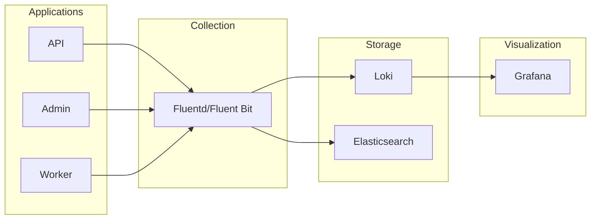

# Logging Configuration

This guide covers logging setup, configuration, and best practices for the Festivals platform.

## Overview



## Log Configuration

### Backend API (Go)

The API uses structured JSON logging with zerolog:

```go
// Logger initialization
logger := logging.Init(logging.Config{
    Level:       os.Getenv("LOG_LEVEL"),    // debug, info, warn, error
    Environment: os.Getenv("ENVIRONMENT"),   // development, production
    ServiceName: "festivals-api",
    Version:     version,
})
```

### Environment Variables

| Variable | Default | Description |
|----------|---------|-------------|
| `LOG_LEVEL` | `info` | Minimum log level |
| `LOG_FORMAT` | `console` | Log format (`console`, `json`) |
| `SERVICE_NAME` | `festivals-api` | Service name in logs |

### Log Levels

| Level | Usage |
|-------|-------|
| `debug` | Detailed debugging information |
| `info` | General operational messages |
| `warn` | Warning conditions |
| `error` | Error conditions |
| `fatal` | Critical errors (exits process) |

## Log Format

### JSON Format (Production)

```json
{
  "level": "info",
  "time": "2024-01-15T10:30:00.123Z",
  "service": "festivals-api",
  "version": "1.0.0",
  "request_id": "abc-123-def-456",
  "method": "POST",
  "path": "/api/v1/payments",
  "status": 200,
  "latency": 45.23,
  "ip": "192.168.1.100",
  "user_id": "user-123",
  "message": "Request completed"
}
```

### Console Format (Development)

```
2024-01-15T10:30:00.123Z INF Request completed service=festivals-api request_id=abc-123 method=POST path=/api/v1/payments status=200 latency=45.23ms
```

## Structured Logging Practices

### Request Logging

Every HTTP request is logged with:

```go
// Logged automatically by middleware
{
  "request_id": "uuid",
  "method": "POST",
  "path": "/api/v1/payments",
  "ip": "192.168.1.100",
  "user_agent": "Mozilla/5.0...",
  "status": 200,
  "latency": 45.23,
  "size": 1234
}
```

### Application Logging

```go
// Context-aware logging
logging.LogInfo(ctx, "Payment processed", map[string]interface{}{
    "transaction_id": txn.ID,
    "wallet_id":      wallet.ID,
    "amount":         amount,
    "festival_id":    festivalID,
})

// Error logging with stack trace
logging.LogError(ctx, err, "Failed to process payment")
```

### Sensitive Data

Never log sensitive data:

```go
// BAD - Don't do this
log.Info().Str("password", password).Msg("User login")
log.Info().Str("token", token).Msg("Auth request")
log.Info().Str("card_number", card).Msg("Payment")

// GOOD - Log IDs and metadata only
log.Info().Str("user_id", userID).Msg("User login")
log.Info().Str("token_prefix", token[:8]).Msg("Auth request")
log.Info().Str("card_last4", card[len(card)-4:]).Msg("Payment")
```

## Log Collection

### Fluent Bit (Kubernetes)

```yaml
apiVersion: v1
kind: ConfigMap
metadata:
  name: fluent-bit-config
  namespace: logging
data:
  fluent-bit.conf: |
    [SERVICE]
        Flush         5
        Log_Level     info
        Daemon        off
        Parsers_File  parsers.conf

    [INPUT]
        Name              tail
        Tag               kube.*
        Path              /var/log/containers/*.log
        Parser            docker
        DB                /var/log/flb_kube.db
        Mem_Buf_Limit     5MB
        Skip_Long_Lines   On
        Refresh_Interval  10

    [FILTER]
        Name                kubernetes
        Match               kube.*
        Kube_URL            https://kubernetes.default.svc:443
        Kube_CA_File        /var/run/secrets/kubernetes.io/serviceaccount/ca.crt
        Kube_Token_File     /var/run/secrets/kubernetes.io/serviceaccount/token
        Merge_Log           On
        K8S-Logging.Parser  On
        K8S-Logging.Exclude On

    [FILTER]
        Name    modify
        Match   kube.*
        Add     cluster production

    [OUTPUT]
        Name            loki
        Match           kube.*
        Host            loki.logging.svc.cluster.local
        Port            3100
        Labels          job=fluentbit, app=$kubernetes['labels']['app']
        Remove_Keys     kubernetes
        Auto_Kubernetes_Labels on

  parsers.conf: |
    [PARSER]
        Name        docker
        Format      json
        Time_Key    time
        Time_Format %Y-%m-%dT%H:%M:%S.%L
        Time_Keep   On

    [PARSER]
        Name        json
        Format      json
        Time_Key    time
        Time_Format %Y-%m-%dT%H:%M:%S.%LZ
```

### Loki Installation

```bash
helm repo add grafana https://grafana.github.io/helm-charts

helm install loki grafana/loki-stack \
  --namespace logging \
  --set loki.persistence.enabled=true \
  --set loki.persistence.size=50Gi \
  --set promtail.enabled=true
```

### Loki Configuration

```yaml
loki:
  auth_enabled: false

  server:
    http_listen_port: 3100

  ingester:
    lifecycler:
      ring:
        kvstore:
          store: inmemory
        replication_factor: 1
    chunk_idle_period: 5m
    chunk_retain_period: 30s

  schema_config:
    configs:
      - from: 2024-01-01
        store: boltdb-shipper
        object_store: filesystem
        schema: v11
        index:
          prefix: index_
          period: 24h

  storage_config:
    boltdb_shipper:
      active_index_directory: /data/loki/boltdb-shipper-active
      cache_location: /data/loki/boltdb-shipper-cache
      shared_store: filesystem
    filesystem:
      directory: /data/loki/chunks

  limits_config:
    enforce_metric_name: false
    reject_old_samples: true
    reject_old_samples_max_age: 168h

  chunk_store_config:
    max_look_back_period: 0s

  table_manager:
    retention_deletes_enabled: true
    retention_period: 720h  # 30 days
```

## Querying Logs

### Grafana Explore

LogQL queries for common scenarios:

```logql
# All logs from API
{app="festivals-api"}

# Error logs only
{app="festivals-api"} |= "error"

# Logs for specific request
{app="festivals-api"} |= "request_id=abc-123"

# Parse JSON and filter
{app="festivals-api"} | json | status >= 500

# Payment processing logs
{app="festivals-api"} |= "payment" | json | amount > 1000

# Slow requests (> 1 second)
{app="festivals-api"} | json | latency > 1000

# Count errors by path
sum(rate({app="festivals-api"} | json | status >= 500 [5m])) by (path)
```

### CLI Access

```bash
# Using logcli
logcli query '{app="festivals-api"}' --limit=100

# Filter by time
logcli query '{app="festivals-api"}' \
  --from="2024-01-15T10:00:00Z" \
  --to="2024-01-15T11:00:00Z"

# JSON output
logcli query '{app="festivals-api"} | json' --output=jsonl
```

## Log Retention

### Retention Policies

| Log Type | Retention | Storage |
|----------|-----------|---------|
| Application logs | 30 days | Loki/S3 |
| Access logs | 90 days | S3 |
| Audit logs | 1 year | S3 Glacier |
| Debug logs | 7 days | Local |

### S3 Archival

```yaml
# Loki S3 configuration
storage_config:
  aws:
    s3: s3://eu-west-1/festivals-logs
    bucketnames: festivals-logs
    region: eu-west-1

  boltdb_shipper:
    active_index_directory: /data/loki/index
    cache_location: /data/loki/cache
    shared_store: s3
```

## Audit Logging

### What to Audit

| Event | Details |
|-------|---------|
| Authentication | Login success/failure, token refresh |
| Authorization | Permission denied, role changes |
| Data Access | Read sensitive data |
| Data Modification | Create, update, delete operations |
| Admin Actions | User management, configuration changes |

### Audit Log Format

```json
{
  "timestamp": "2024-01-15T10:30:00Z",
  "event_type": "data.modified",
  "actor": {
    "user_id": "user-123",
    "email": "admin@example.com",
    "ip": "192.168.1.100",
    "user_agent": "Mozilla/5.0..."
  },
  "resource": {
    "type": "festival",
    "id": "festival-456",
    "action": "update"
  },
  "changes": {
    "before": {"status": "draft"},
    "after": {"status": "active"}
  },
  "metadata": {
    "request_id": "abc-123",
    "festival_id": "festival-456"
  }
}
```

## Log Analysis

### Common Patterns

```bash
# Find all errors in the last hour
{app="festivals-api"} | json | level="error" [1h]

# Track payment failures
{app="festivals-api"} |= "payment" |= "failed" | json

# Find slow database queries
{app="festivals-api"} |= "db_query" | json | duration > 100

# Count requests by status code
sum(count_over_time({app="festivals-api"} | json [1h])) by (status)

# Find 5xx errors grouped by endpoint
{app="festivals-api"} | json | status >= 500 | line_format "{{.path}}" | count by (path)
```

### Dashboards

Key log-based panels:

1. **Error Rate by Service**
   ```logql
   sum(rate({app=~"festivals-.*"} | json | status >= 500 [5m])) by (app)
   ```

2. **Top Error Messages**
   ```logql
   topk(10, sum(count_over_time({app="festivals-api"} | json | level="error" [1h])) by (message))
   ```

3. **Request Volume by Path**
   ```logql
   sum(rate({app="festivals-api"} | json [5m])) by (path)
   ```

## Troubleshooting with Logs

### Finding Request Issues

```bash
# 1. Find the request ID from error response
# 2. Query all logs for that request
{app=~"festivals-.*"} |= "request_id=abc-123"

# 3. See the full request lifecycle
{app="festivals-api"} |= "abc-123" | json | line_format "{{.time}} [{{.level}}] {{.message}}"
```

### Tracing Transactions

```bash
# Find all logs for a transaction
{app=~"festivals-.*"} |= "transaction_id=tx-456"

# Track payment through system
{app=~"festivals-.*"} |= "wallet_id=wallet-789" | json | event_type=~"payment.*"
```

## Best Practices

1. **Use structured logging** - Always log in JSON format in production
2. **Include request IDs** - Trace requests across services
3. **Log business events** - Not just errors, but significant actions
4. **Don't log sensitive data** - PII, passwords, tokens, card numbers
5. **Use appropriate levels** - Reserve ERROR for actual errors
6. **Include context** - User ID, festival ID, transaction ID
7. **Keep logs concise** - Don't log entire request/response bodies
8. **Centralize logs** - Use a log aggregation system
9. **Set retention policies** - Don't keep logs forever
10. **Monitor log volume** - Alert on unusual spikes

## Related Documentation

- [Monitoring](./MONITORING.md)
- [Alerting](./ALERTING.md)
- [Runbook](./RUNBOOK.md)
