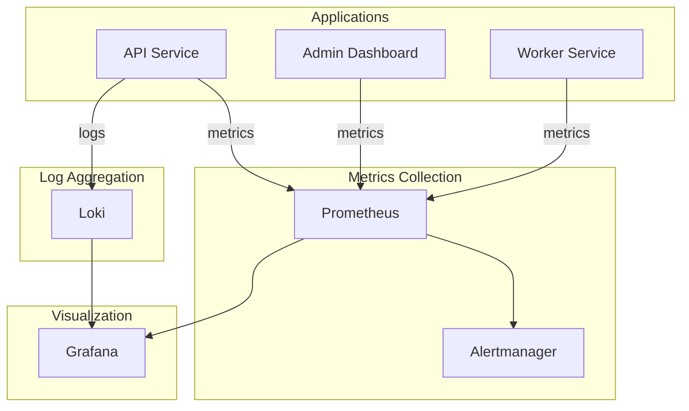

# Monitoring Setup

This guide covers monitoring infrastructure for the Festivals platform using Prometheus, Grafana, and related tools.

## Table of Contents

1. [Overview](#overview)
2. [Quick Start](#quick-start)
3. [Architecture](#architecture)
4. [Prometheus Setup](#prometheus-setup)
5. [Application Metrics](#application-metrics)
6. [Grafana Dashboards](#grafana-dashboards)
7. [SLOs and Error Budgets](#slos-and-error-budgets)
8. [Alert Categories](#alert-categories)
9. [Runbooks](#runbooks)
10. [Escalation Procedures](#escalation-procedures)
11. [Maintenance](#maintenance)

---

## Overview



### Component Summary

| Component | Purpose | Port |
|-----------|---------|------|
| Prometheus | Metrics collection and alerting | 9090 |
| Grafana | Visualization and dashboards | 3001 |
| AlertManager | Alert routing and notifications | 9093 |
| Node Exporter | Host metrics | 9100 |
| Redis Exporter | Redis metrics | 9121 |
| Postgres Exporter | PostgreSQL metrics | 9187 |
| cAdvisor | Container metrics | 8081 |

---

## Quick Start

### Starting the Monitoring Stack (Docker Compose)

```bash
# Start the monitoring stack
docker-compose -f infrastructure/monitoring/docker-compose.monitoring.yml up -d

# Check status
docker-compose -f infrastructure/monitoring/docker-compose.monitoring.yml ps

# View logs
docker-compose -f infrastructure/monitoring/docker-compose.monitoring.yml logs -f prometheus
```

### Accessing Services

| Service | URL | Default Credentials |
|---------|-----|---------------------|
| Grafana | http://localhost:3001 | admin / admin |
| Prometheus | http://localhost:9090 | N/A |
| AlertManager | http://localhost:9093 | N/A |

### Environment Variables

```bash
# Grafana
GRAFANA_ADMIN_USER=admin
GRAFANA_ADMIN_PASSWORD=secure-password
GRAFANA_ROOT_URL=https://grafana.festivals.io

# AlertManager
SLACK_WEBHOOK_URL=https://hooks.slack.com/services/...
PAGERDUTY_SERVICE_KEY=your-service-key
SMTP_HOST=smtp.example.com
SMTP_PORT=587
SMTP_FROM=alerts@festivals.io
SMTP_USERNAME=alerts@festivals.io
SMTP_PASSWORD=smtp-password
```

---

## Architecture

### Data Flow

```
                     +------------------+
                     |   AlertManager   |
                     | (notifications)  |
                     +--------+---------+
                              ^
                              | alerts
                     +--------+---------+
                     |    Prometheus    |
                     | (metrics store)  |
                     +--------+---------+
                              ^
              +---------------+---------------+
              |               |               |
    +---------+---------+  +--+--+  +---------+---------+
    |   Festival API    |  | ... |  |  Postgres/Redis   |
    | (app metrics)     |  |     |  |    Exporters      |
    +-------------------+  +-----+  +-------------------+
```

---

## Prometheus Setup

### Installation (Kubernetes)

Using Prometheus Operator:

```bash
# Add Prometheus community Helm repo
helm repo add prometheus-community https://prometheus-community.github.io/helm-charts

# Install kube-prometheus-stack
helm install prometheus prometheus-community/kube-prometheus-stack \
  --namespace monitoring \
  --create-namespace \
  --values prometheus-values.yaml
```

### prometheus-values.yaml

```yaml
prometheus:
  prometheusSpec:
    retention: 30d
    retentionSize: 50GB
    storageSpec:
      volumeClaimTemplate:
        spec:
          accessModes: ["ReadWriteOnce"]
          resources:
            requests:
              storage: 100Gi

    # Scrape configuration
    additionalScrapeConfigs:
      - job_name: 'festivals-api'
        kubernetes_sd_configs:
          - role: pod
        relabel_configs:
          - source_labels: [__meta_kubernetes_pod_label_app]
            regex: festivals-api
            action: keep
          - source_labels: [__meta_kubernetes_pod_container_port_name]
            regex: metrics
            action: keep

grafana:
  enabled: true
  adminPassword: ${GRAFANA_ADMIN_PASSWORD}
  persistence:
    enabled: true
    size: 10Gi

alertmanager:
  enabled: true
  config:
    global:
      smtp_smarthost: 'smtp.example.com:587'
      smtp_from: 'alerts@festivals.app'
    route:
      group_by: ['alertname', 'cluster', 'service']
      group_wait: 10s
      group_interval: 10s
      repeat_interval: 1h
      receiver: 'default'
      routes:
        - match:
            severity: critical
          receiver: 'pagerduty'
        - match:
            severity: warning
          receiver: 'slack'
    receivers:
      - name: 'default'
        email_configs:
          - to: 'team@festivals.app'
      - name: 'slack'
        slack_configs:
          - api_url: '${SLACK_WEBHOOK_URL}'
            channel: '#alerts'
      - name: 'pagerduty'
        pagerduty_configs:
          - service_key: '${PAGERDUTY_SERVICE_KEY}'
```

---

## Application Metrics

### Exposed Metrics

The API exposes Prometheus metrics at `/metrics`:

```go
// HTTP metrics
festivals_http_requests_total{method, path, status}
festivals_http_request_duration_seconds{method, path}
festivals_http_requests_in_flight
festivals_http_response_size_bytes{method, path}

// Database metrics
festivals_db_queries_total{operation, table, status}
festivals_db_query_duration_seconds{operation, table}
festivals_db_connections_open
festivals_db_connections_idle
festivals_db_connections_in_use
festivals_db_errors_total{operation, error_type}

// Cache metrics
festivals_cache_hits_total{cache_name}
festivals_cache_misses_total{cache_name}
festivals_cache_hit_ratio{cache_name}
festivals_cache_operations_total{cache_name, operation, status}
festivals_cache_operation_duration_seconds{cache_name, operation}

// Business metrics
festivals_transactions_total{festival_id, type, status}
festivals_transaction_amount_cents{festival_id, type}
festivals_wallets_created_total
festivals_wallets_active
festivals_tickets_issued_total{festival_id, ticket_type}
festivals_tickets_scanned_total{festival_id, scan_type}
festivals_festivals_active
festivals_festival_attendees_current{festival_id}

// Error metrics
festivals_errors_total{type, operation}
```

### ServiceMonitor

```yaml
apiVersion: monitoring.coreos.com/v1
kind: ServiceMonitor
metadata:
  name: festivals-api
  namespace: festivals
  labels:
    release: prometheus
spec:
  selector:
    matchLabels:
      app: festivals-api
  namespaceSelector:
    matchNames:
      - festivals
  endpoints:
    - port: metrics
      interval: 30s
      path: /metrics
      scrapeTimeout: 10s
```

---

## Grafana Dashboards

### Available Dashboards

| Dashboard | Location | Purpose |
|-----------|----------|---------|
| API Overview | `grafana/dashboards/api.json` | Request rates, latency, errors, SLOs |
| Business Metrics | `grafana/dashboards/business.json` | Transactions, revenue, users |
| Infrastructure | `grafana/dashboards/infrastructure.json` | DB, Redis, CPU, Memory, Disk |

### API Overview Dashboard

**Key Panels:**

| Panel | Description | Healthy Range |
|-------|-------------|---------------|
| API Availability | Percentage of successful requests | > 99.9% |
| Latency SLI | Percentage of requests < 500ms | > 99% |
| Error Budget | Remaining error budget for the month | > 0% |
| Request Rate | Requests per second by status | Varies |
| Latency Percentiles | P50, P95, P99 latency | P99 < 2s |
| Error Rate | 5xx error rate | < 0.1% |

### Business Metrics Dashboard

**Key Panels:**

| Panel | Description | Healthy Range |
|-------|-------------|---------------|
| Active Festivals | Number of currently active festivals | Context-dependent |
| Total Attendees | Sum of current attendees across festivals | Context-dependent |
| Revenue/Minute | Revenue generated per minute | > $0 during active festivals |
| Transaction Success Rate | Percentage of successful transactions | > 99.5% |
| Transactions by Type | Breakdown of transaction types | N/A |
| Ticket Scan Success Rate | Percentage of successful ticket scans | > 99% |

### Infrastructure Dashboard

**Key Panels:**

| Panel | Description | Warning | Critical |
|-------|-------------|---------|----------|
| Service Health | UP/DOWN status of services | Any DOWN | Multiple DOWN |
| PostgreSQL Connections | Connection pool usage | > 80% | > 95% |
| Redis Memory | Memory utilization | > 80% | > 95% |
| CPU Usage | Host CPU utilization | > 70% | > 90% |
| Memory Usage | Host memory utilization | > 80% | > 95% |
| Disk Usage | Host disk utilization | > 70% | > 90% |

---

## SLOs and Error Budgets

### Defined SLOs

| SLO | Target | Window | Indicator |
|-----|--------|--------|-----------|
| API Availability | 99.9% | 30 days | Non-5xx responses / Total requests |
| API Latency | 99% < 500ms | 30 days | Requests < 500ms / Total requests |
| Transaction Success | 99.5% | 30 days | Successful transactions / Total transactions |
| Ticket Scan Success | 99% | 30 days | Successful scans / Total scans |

### Error Budget Calculation

Error Budget = (1 - SLO Target) * Time Window

For 99.9% availability over 30 days:
- Error budget = 0.1% of 30 days = 43.2 minutes of downtime

### Burn Rate Alerts

Multi-window, multi-burn-rate alerting to detect SLO breaches:

| Alert Level | Burn Rate | Detection Window | Description |
|-------------|-----------|------------------|-------------|
| Page (Critical) | 14.4x | 1 hour | Will exhaust 30-day budget in ~2 days |
| Ticket (Warning) | 6x | 6 hours | Will exhaust 30-day budget in ~5 days |
| Info | 1x | 3 days | On track to exceed budget |

### Recording Rules

```yaml
groups:
  - name: festivals.rules
    rules:
      # Request rate
      - record: festivals:http_requests:rate5m
        expr: sum(rate(festivals_http_requests_total[5m]))

      # Error rate
      - record: festivals:http_errors:rate5m
        expr: sum(rate(festivals_http_requests_total{status=~"5.."}[5m]))

      # Error percentage
      - record: festivals:http_error_percentage:5m
        expr: festivals:http_errors:rate5m / festivals:http_requests:rate5m * 100

      # Latency percentiles
      - record: festivals:http_latency:p99
        expr: histogram_quantile(0.99, sum(rate(festivals_http_request_duration_seconds_bucket[5m])) by (le))

      - record: festivals:http_latency:p95
        expr: histogram_quantile(0.95, sum(rate(festivals_http_request_duration_seconds_bucket[5m])) by (le))

      - record: festivals:http_latency:p50
        expr: histogram_quantile(0.50, sum(rate(festivals_http_request_duration_seconds_bucket[5m])) by (le))

      # Availability (over 5m window)
      - record: festivals:availability:5m
        expr: 1 - (festivals:http_errors:rate5m / festivals:http_requests:rate5m)

      # SLIs
      - record: festivals:sli:availability_1h
        expr: |
          sum(rate(festivals_http_requests_total{status!~"5.."}[1h]))
          /
          sum(rate(festivals_http_requests_total[1h]))

      - record: festivals:sli:latency_1h
        expr: |
          sum(rate(festivals_http_request_duration_seconds_bucket{le="0.5"}[1h]))
          /
          sum(rate(festivals_http_request_duration_seconds_count[1h]))
```

---

## Alert Categories

### Alert Severity Levels

| Severity | Response Time | Notification Channels | Examples |
|----------|---------------|----------------------|----------|
| **Critical** | < 15 min | PagerDuty + Slack | API down, DB down, >5% error rate |
| **Warning** | < 1 hour | Slack | High latency, high connection usage |
| **Info** | Next business day | Email | Capacity warnings, trends |

### API Alerts (`prometheus/alerts/api.yml`)

| Alert | Severity | Description | Threshold |
|-------|----------|-------------|-----------|
| `APIHighErrorRate` | Critical | High 5xx error rate | > 5% for 5m |
| `APIHighLatencyP99` | Warning | High P99 latency | > 2s for 5m |
| `APIHighLatencyP99Critical` | Critical | Critical P99 latency | > 5s for 2m |
| `APIDown` | Critical | API not responding | down for 1m |
| `APIHighRequestRate` | Warning | Potential traffic spike | > 1000 req/s for 5m |

### Database Alerts (`prometheus/alerts/database.yml`)

| Alert | Severity | Description | Threshold |
|-------|----------|-------------|-----------|
| `PostgreSQLDown` | Critical | PostgreSQL not responding | down for 1m |
| `PostgreSQLHighConnectionUsage` | Warning | High connection pool usage | > 80% for 5m |
| `PostgreSQLCriticalConnectionUsage` | Critical | Critical connection usage | > 95% for 2m |
| `PostgreSQLSlowQueries` | Warning | Long-running transactions | > 30s for 5m |

### Redis Alerts (`prometheus/alerts/redis.yml`)

| Alert | Severity | Description | Threshold |
|-------|----------|-------------|-----------|
| `RedisDown` | Critical | Redis not responding | down for 1m |
| `RedisHighMemoryUsage` | Warning | High memory usage | > 80% for 5m |
| `RedisCriticalMemoryUsage` | Critical | Critical memory usage | > 95% for 2m |
| `RedisLowHitRate` | Warning | Low cache hit rate | < 80% for 15m |

### Business Alerts (`prometheus/alerts/business.yml`)

| Alert | Severity | Description | Threshold |
|-------|----------|-------------|-----------|
| `HighFailedTransactionRate` | Critical | High transaction failure rate | > 5% for 5m |
| `TransactionVolumeDrop` | Warning | Significant volume drop | < 50% of 1h ago |
| `NoTransactions` | Warning | No transactions during active festival | 0 for 15m |
| `HighTicketScanFailureRate` | Warning | High ticket scan failures | > 10% for 10m |

### Managing Alerts

#### Silencing Alerts

**Via AlertManager UI:**
1. Go to http://localhost:9093
2. Click "Silences" > "New Silence"
3. Add matchers (e.g., `alertname=APIHighLatencyP99`)
4. Set duration and add a comment

**Via API:**
```bash
curl -X POST http://localhost:8080/api/v1/monitoring/alerts/APIHighLatencyP99/silence \
  -H "Content-Type: application/json" \
  -d '{"duration": "2h", "reason": "Maintenance window"}'
```

---

## Runbooks

### High-Level Troubleshooting Flow

```
Alert Triggered
      |
      v
  Check Grafana Dashboard
      |
      v
  Identify Affected Component
      |
      v
  Check Component Logs
      |
      v
  Apply Fix (see specific runbooks)
      |
      v
  Verify Resolution
      |
      v
  Document Incident
```

### Runbook: API High Error Rate

**Alert:** `APIHighErrorRate`

**Investigation Steps:**

1. **Check error distribution:**
   ```promql
   sum(rate(festivals_http_requests_total{status=~"5.."}[5m])) by (path)
   ```

2. **Check recent deployments:**
   ```bash
   kubectl rollout history deployment/api
   ```

3. **Check logs:**
   ```bash
   kubectl logs -l app=api --tail=1000 | grep -i error
   ```

4. **Check dependencies:**
   - PostgreSQL: Connection count, slow queries
   - Redis: Memory, connection count

**Resolution:**

1. **If caused by deployment:** Roll back
   ```bash
   kubectl rollout undo deployment/api
   ```

2. **If caused by database:** Scale connections or optimize queries

3. **If caused by traffic spike:** Scale API pods
   ```bash
   kubectl scale deployment/api --replicas=5
   ```

### Runbook: Database Connection Exhaustion

**Alert:** `PostgreSQLCriticalConnectionUsage`

**Investigation Steps:**

1. **Check active connections:**
   ```sql
   SELECT count(*), state
   FROM pg_stat_activity
   GROUP BY state;
   ```

2. **Find long-running queries:**
   ```sql
   SELECT pid, now() - pg_stat_activity.query_start AS duration, query
   FROM pg_stat_activity
   WHERE state != 'idle'
   ORDER BY duration DESC
   LIMIT 10;
   ```

**Resolution:**

1. **Kill idle connections:**
   ```sql
   SELECT pg_terminate_backend(pid)
   FROM pg_stat_activity
   WHERE state = 'idle'
   AND query_start < now() - interval '5 minutes';
   ```

2. **Increase connection limit (temporary):**
   ```sql
   ALTER SYSTEM SET max_connections = 200;
   SELECT pg_reload_conf();
   ```

### Runbook: Redis Memory Critical

**Alert:** `RedisCriticalMemoryUsage`

**Investigation Steps:**

1. **Check memory usage:**
   ```bash
   redis-cli info memory
   ```

2. **Check key distribution:**
   ```bash
   redis-cli --bigkeys
   ```

**Resolution:**

1. **Flush specific cache prefixes (if safe):**
   ```bash
   redis-cli --scan --pattern "cache:temp:*" | xargs redis-cli del
   ```

2. **Increase memory limit:**
   ```bash
   redis-cli config set maxmemory 2gb
   ```

---

## Escalation Procedures

### On-Call Rotation

| Team | Primary Contact | Escalation Contact |
|------|-----------------|-------------------|
| SRE | PagerDuty rotation | VP of Engineering |
| DBA | DBA on-call | SRE team |
| Backend | Backend on-call | SRE team |
| Security | Security on-call | CISO |

### Escalation Matrix

| Severity | Initial Response | Escalation Time | Escalation To |
|----------|-----------------|-----------------|---------------|
| Critical | On-call engineer | 15 minutes | Team lead |
| Critical (unresolved) | Team lead | 30 minutes | VP Engineering |
| Warning | On-call engineer | 1 hour | Team lead |
| Info | Review next business day | N/A | N/A |

### Communication Channels

| Channel | Purpose |
|---------|---------|
| #incidents | Real-time incident coordination |
| #festivals-critical | Critical alert notifications |
| #festivals-warnings | Warning alert notifications |
| #festivals-slo | SLO breach notifications |

### Incident Response Template

```markdown
## Incident: [Brief Title]

**Severity:** Critical / Warning
**Status:** Investigating / Identified / Monitoring / Resolved
**Start Time:** YYYY-MM-DD HH:MM UTC
**End Time:** YYYY-MM-DD HH:MM UTC (if resolved)

### Summary
[Brief description of the incident]

### Impact
- [User-facing impact]
- [Number of affected users/transactions]

### Timeline
- HH:MM - Alert triggered
- HH:MM - Investigation started
- HH:MM - Root cause identified
- HH:MM - Fix deployed
- HH:MM - Incident resolved

### Root Cause
[Technical description of what went wrong]

### Resolution
[What was done to fix the issue]

### Action Items
- [ ] Item 1
- [ ] Item 2

### Lessons Learned
[What can be improved to prevent recurrence]
```

---

## Maintenance

### Regular Tasks

| Task | Frequency | Owner |
|------|-----------|-------|
| Review alert thresholds | Monthly | SRE |
| Update runbooks | After each incident | Incident owner |
| Prune old metrics data | Weekly (automated) | Prometheus |
| Review SLO compliance | Weekly | SRE |
| Dashboard review | Quarterly | Platform team |

### Prometheus Maintenance

**Storage Management:**
```bash
# Check disk usage
docker exec festivals-prometheus df -h /prometheus

# Force garbage collection (if needed)
curl -X POST http://localhost:9090/-/reload
```

**Configuration Reload:**
```bash
curl -X POST http://localhost:9090/-/reload
```

### Grafana Maintenance

**Export Dashboards:**
```bash
curl -H "Authorization: Bearer $GRAFANA_API_KEY" \
  http://localhost:3001/api/dashboards/uid/festivals-api-overview \
  > dashboards/api.json
```

**Import Dashboards:**
```bash
curl -X POST -H "Authorization: Bearer $GRAFANA_API_KEY" \
  -H "Content-Type: application/json" \
  -d @dashboards/api.json \
  http://localhost:3001/api/dashboards/db
```

---

## Appendix

### Useful PromQL Queries

**Request Rate:**
```promql
sum(rate(festivals_http_requests_total[5m])) by (path)
```

**Error Rate:**
```promql
sum(rate(festivals_http_requests_total{status=~"5.."}[5m]))
/
sum(rate(festivals_http_requests_total[5m]))
```

**P99 Latency:**
```promql
histogram_quantile(0.99,
  sum(rate(festivals_http_request_duration_seconds_bucket[5m])) by (le)
)
```

**Transaction Success Rate:**
```promql
sum(rate(festivals_transactions_total{status="success"}[5m]))
/
sum(rate(festivals_transactions_total[5m]))
```

**Cache Hit Rate:**
```promql
sum(rate(festivals_cache_hits_total[5m]))
/
(sum(rate(festivals_cache_hits_total[5m])) + sum(rate(festivals_cache_misses_total[5m])))
```

### Metric Naming Convention

All application metrics follow the pattern:
```
festivals_<subsystem>_<metric>_<unit>
```

Examples:
- `festivals_http_requests_total` - Counter of HTTP requests
- `festivals_http_request_duration_seconds` - Histogram of request durations
- `festivals_transactions_total` - Counter of transactions
- `festivals_cache_hits_total` - Counter of cache hits

### Contact Information

| Role | Contact |
|------|---------|
| SRE Team | sre@festivals.io |
| Platform Team | platform@festivals.io |
| On-Call | oncall@festivals.io |
| Emergency | +1-555-FESTIVAL |

---

## Related Documentation

- [Alerting](./ALERTING.md)
- [Logging](./LOGGING.md)
- [Runbook](./RUNBOOK.md)
- [Disaster Recovery](./DISASTER_RECOVERY.md)
